# ATT Service Delivery Platform — Architecture Design Document

**Document version:** 1.0  
**Date:** June 2026  
**Repository:** [anayyar82/pltr-dbx](https://github.com/anayyar82/pltr-dbx)  
**Status:** As-built (reference deployment on `e2-demo-field-eng`)

---

## Table of contents

1. [Purpose and scope](#1-purpose-and-scope)
2. [Design goals](#2-design-goals)
3. [System context](#3-system-context)
4. [Logical architecture](#4-logical-architecture)
5. [Data architecture](#5-data-architecture)
6. [Component design](#6-component-design)
7. [Integration and data flows](#7-integration-and-data-flows)
8. [Foundry parity mapping](#8-foundry-parity-mapping)
9. [Security and governance](#9-security-and-governance)
10. [Deployment architecture](#10-deployment-architecture)
11. [Non-functional characteristics](#11-non-functional-characteristics)
12. [Design decisions and trade-offs](#12-design-decisions-and-trade-offs)
13. [Appendix](#13-appendix)

---

## 1. Purpose and scope

### 1.1 Purpose

This document describes the **as-built architecture** of the ATT Service Delivery Platform (SDP) demo migrated from Palantir Foundry to Databricks. It is intended for architects, field engineers, and customer stakeholders evaluating:

- How Foundry concepts map to Databricks primitives
- How batch analytics and operational (OLTP-style) workloads coexist
- How to deploy the same pattern to a new workspace

### 1.2 In scope

| Area | Description |
|------|-------------|
| Batch ingest | Bronze → DLT → Gold → Semantic layer |
| Operational read/write | Lakebase Postgres + UC mirrors |
| Human-facing UI | Databricks App (Ops Console) |
| NL analytics | Genie Space |
| Agentic workflows | Agent Triage with human approval |
| Orchestration | Databricks Asset Bundle + Workflow jobs |

### 1.3 Out of scope

- Production ATT network systems (NOC feeds are simulated JSON)
- Multi-region HA and DR runbooks
- Enterprise SSO / SCIM beyond workspace defaults
- Cost modeling and capacity planning

### 1.4 Related documents

| Document | Location |
|----------|----------|
| Project guide (components, runbook) | [docs/ATT_SDP_Project_Guide.md](ATT_SDP_Project_Guide.md) |
| Workspace installer | [install/README.md](../install/README.md) |
| Foundry inventory | [config/att_sdp_mapping.yaml](../config/att_sdp_mapping.yaml) |

---

## 2. Design goals

| Goal | Design response |
|------|-----------------|
| **Foundry parity** | Explicit 1:1 mapping: Objects → UC, Builds → DLT, Workshop → App, Actions → Lakebase |
| **Governed analytics** | All reads go through Unity Catalog; Genie exposes certified tables/views only |
| **Low-latency ops** | Dispatch writes go to Lakebase Postgres (OLTP), not through DLT |
| **Separation of concerns** | Three distinct data paths: batch, ops-read, ops-write |
| **Demo repeatability** | Bundle jobs + installer CLI for clean redeploy to any workspace |
| **Human-in-the-loop AI** | Agent proposes actions; operator must approve before any write |
| **Observability** | MLflow events for writes, Genie asks, job triggers, agent approvals |

---

## 3. System context

### 3.1 Context diagram

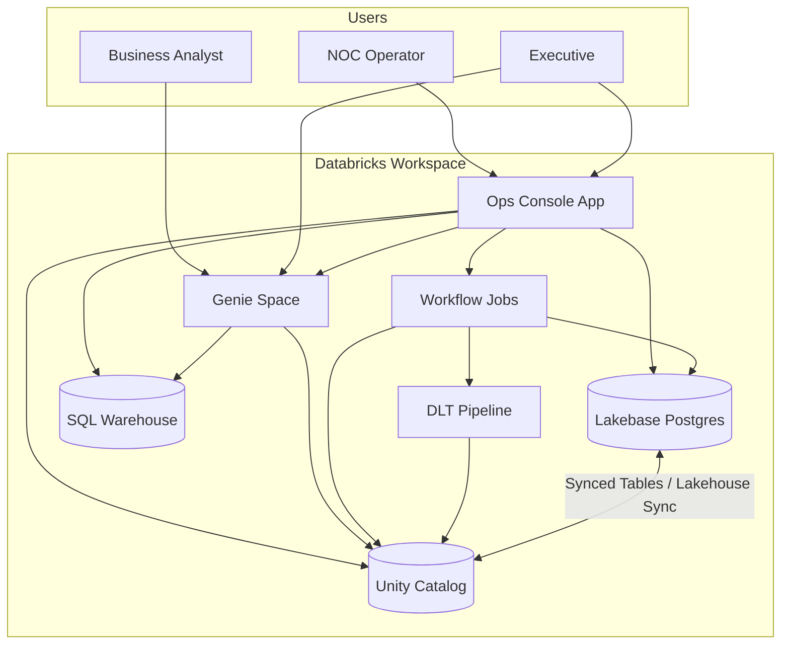

### 3.2 Actors

| Actor | Primary interface | Typical actions |
|-------|-------------------|-----------------|
| NOC operator | Ops Console — Dispatch, Agent Triage | Update incident status, approve agent dispatch |
| Demo presenter | Live Demo tab | Trigger pipeline scenarios |
| Business analyst | Genie Space | Ask NL questions on governed data |
| Platform engineer | Bundle CLI, installer | Deploy, bootstrap, configure workspace |
| App service principal | Background API calls | SQL, Lakebase OAuth, job triggers |

### 3.3 Reference deployment

| Item | Value |
|------|-------|
| Workspace | `e2-demo-field-eng` |
| Catalog.schema | `users.ankur_nayyar` |
| Ops Console App | [att-sdp-ops-ankur](https://att-sdp-ops-ankur-1444828305810485.aws.databricksapps.com/) |
| Lakebase project | `att-ankur-demo` / DB `sdp_ops` |
| Bundle target | `e2_demo` |

---

## 4. Logical architecture

The platform is organized into **five layers**. Each layer has a single responsibility; cross-layer calls follow the three data paths defined in Section 5.

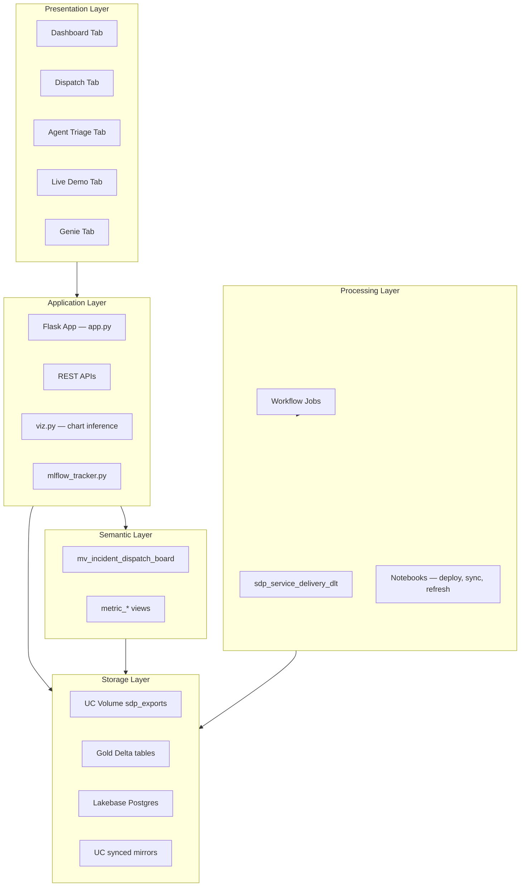

### 4.1 Layer responsibilities

| Layer | Technology | Responsibility |
|-------|------------|----------------|
| Presentation | HTML/JS templates | Five-tab Ops Console UX |
| Application | Flask on Databricks Apps | API orchestration, path selection (Lakebase vs warehouse) |
| Semantic | SQL views + materialized view | KPI rollups, dispatch board join object |
| Processing | DLT + Workflows | Batch ingest, transforms, MV refresh, Lakebase sync |
| Storage | UC Delta + Lakebase Postgres | System of record (lakehouse) + ops OLTP store |

---

## 5. Data architecture

### 5.1 Medallion layout

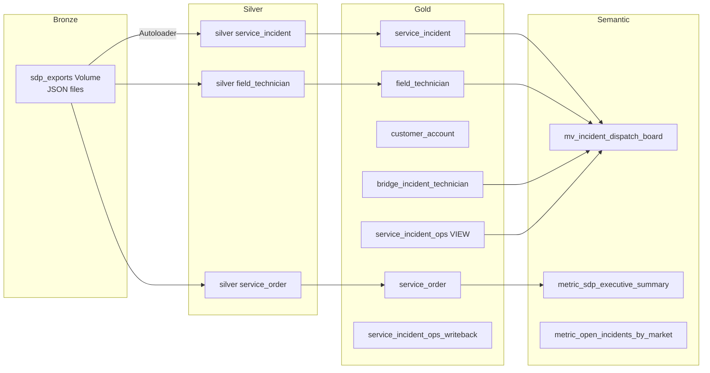

> **Note:** In this demo, bronze/silver/gold share one schema (`users.ankur_nayyar`) for simplicity. Production deployments typically split schemas.

### 5.2 Three data paths

This is the **central architectural invariant**. Misunderstanding which path applies causes most operational confusion.

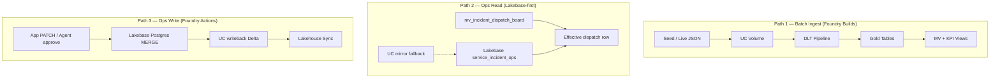

| Path | Trigger | Latency target | Must NOT |
|------|---------|----------------|----------|
| **Batch** | Job `sdp_write_refresh`, Live Demo tab | Minutes | Run on every UI click |
| **Ops read** | Dashboard/Dispatch load | Sub-second | Replace MV for board structure |
| **Ops write** | Status button, agent approval | Sub-second | Block on DLT or full MV rebuild |

### 5.3 Entity model (gold ontology)

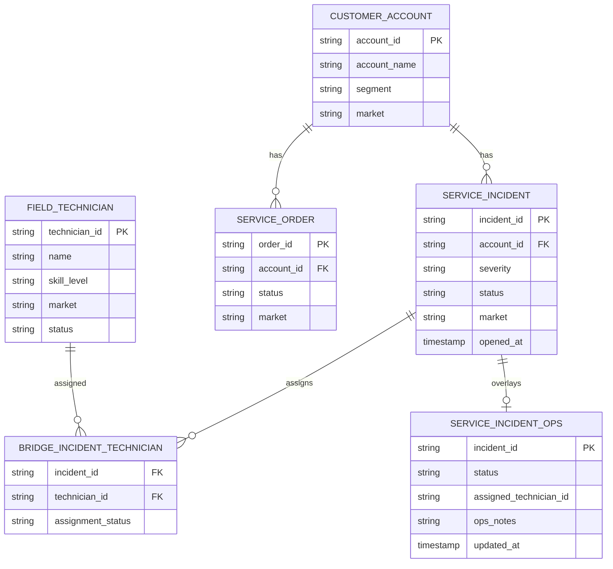

### 5.4 Lakebase sync topology

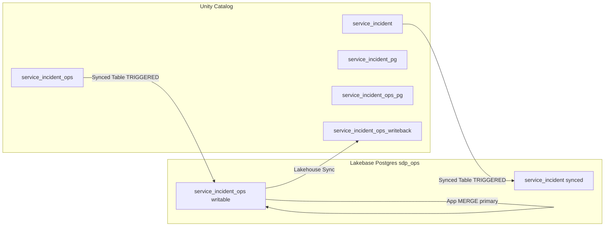

| Direction | Mechanism | Purpose |
|-----------|-----------|---------|
| UC → Postgres | Synced Tables | Low-latency read replica for App overlay |
| Postgres → UC | Lakehouse Sync | Keep lakehouse consistent after ops writes |
| App → Postgres | Direct OAuth MERGE | Primary write path (Foundry Actions) |
| App → UC | Background MERGE to `service_incident_ops_writeback` | Writable Delta fallback when Lakebase unavailable |

**Critical constraint:** Databricks Apps must use the **direct** Postgres host. The pooler host causes SASL OAuth failures for the App service principal.

---

## 6. Component design

### 6.1 Delta Live Tables — `sdp_service_delivery_dlt`

| Attribute | Value |
|-----------|-------|
| Source | `src/pipelines/dlt/sdp_service_delivery.py` |
| Mode | Serverless, ADVANCED, non-continuous |
| Input | UC Volume `sdp_exports` (JSON) |
| Output | Gold managed tables in target schema |
| Expectations | Row-level data quality on bronze/silver |

**Design rationale:** DLT replaces Foundry Builds with declarative pipelines, built-in lineage, and expectations. Incremental runs (`sdp_write_refresh`) append bronze and refresh gold without full redeploy.

### 6.2 Semantic layer

| Asset | Type | Refresh | Consumers |
|-------|------|---------|-----------|
| `mv_incident_dispatch_board` | Materialized View | `REFRESH MATERIALIZED VIEW` (nb 05) | Dispatch, Genie, APIs |
| `metric_sdp_executive_summary` | View | On deploy / DLT refresh | Dashboard, Genie |
| `metric_open_incidents_by_market` | View | On deploy / DLT refresh | Dashboard, Genie |
| `metric_incident_mttr` | View | On deploy | Genie |
| `metric_order_fulfillment_sla` | View | On deploy | Genie |
| `metric_technician_utilization` | View | On deploy | Genie |

**Design rationale:** Materialized view pre-joins incidents, accounts, technicians, and bridge for dispatch UX. KPI views provide Slate-equivalent certified metrics. App applies Lakebase ops overlay **at read time** on top of MV rows.

### 6.3 Ops Console App

| Attribute | Value |
|-----------|-------|
| Runtime | Databricks Apps (Flask) |
| Code | `apps/sdp_ops_console/` |
| Auth | App service principal (OAuth M2M) + optional user token for Genie |

#### Tab architecture

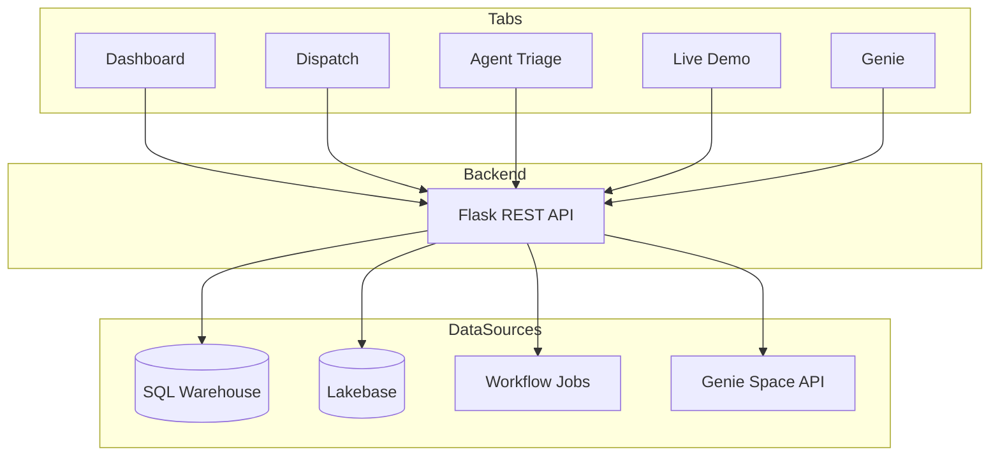

| Tab | Key APIs | Write? |
|-----|----------|--------|
| Dashboard | `GET /api/dashboard` | No |
| Dispatch | `GET/PATCH /api/incidents` | Yes (Lakebase) |
| Agent Triage | `POST /api/agent/*` | Yes (after approval) |
| Live Demo | `POST /api/live/trigger` | Indirect (job) |
| Genie | `POST /api/genie/ask` | No |

#### Dispatch latency demo

The Dispatch tab supports toggling **read path** (Lakebase vs SQL Warehouse) and **write path** for side-by-side latency comparison. A simulation table (`lakebase_latency_demo`) demonstrates insert latency differences.

### 6.4 Agent Triage (AIP pattern)

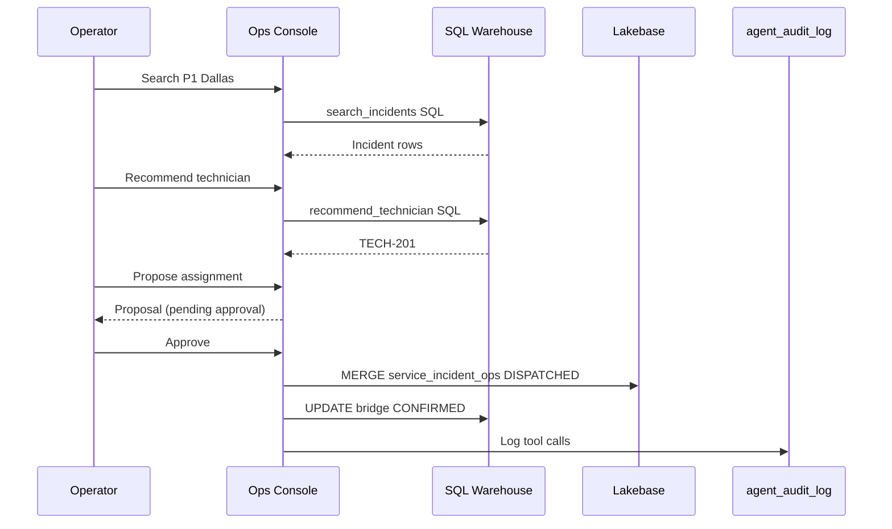

**Design rationale:** Mirrors Foundry AIP with a mandatory human approval gate. No autonomous writes.

### 6.5 Genie Space

| Attribute | Value |
|-----------|-------|
| Config | `config/genie_space.yaml` |
| Create script | `scripts/create_att_sdp_genie_space.py` |
| Tables exposed | 6 governed UC assets |
| Mode | Read-only NL → SQL |

### 6.6 Workflow jobs

| Job | Purpose | Duration |
|-----|---------|----------|
| `sdp_cleanup` | Drop tables, MVs, clear volumes | ~1 min |
| `sdp_semantic_setup` | Full bootstrap + DLT full refresh + semantic | ~8–20 min |
| `sdp_write_refresh` | Incremental live demo (bronze → DLT → sync → MV) | ~3–5 min |
| `sdp_full_pipeline` | End-to-end deploy automation | Varies |
| `sdp_refresh` | Refresh only (no bronze write) | ~2–4 min |

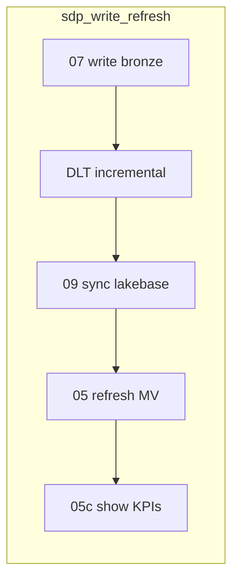

---

## 7. Integration and data flows

### 7.1 Dispatch status update

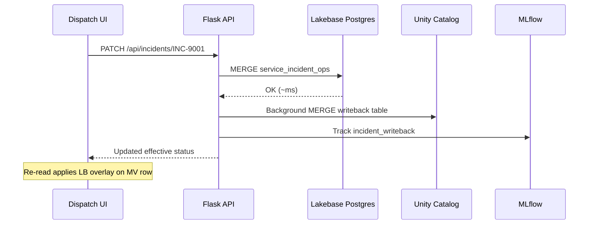

### 7.2 Live Demo pipeline trigger

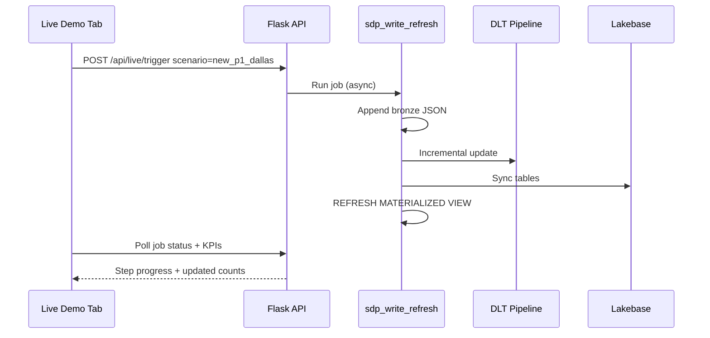

### 7.3 Genie question

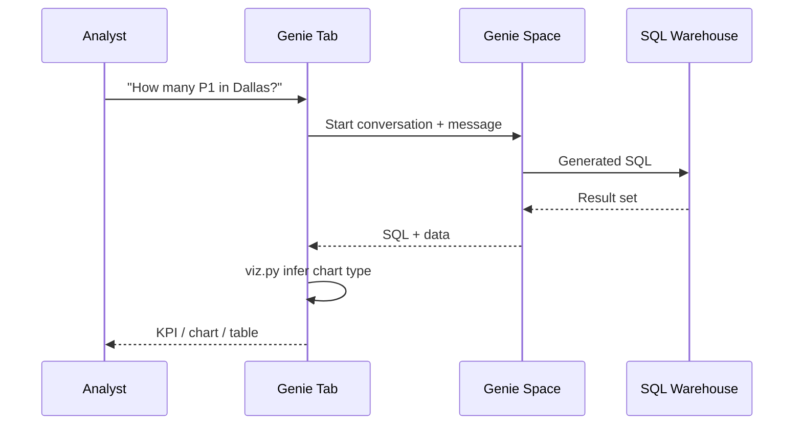

---

## 8. Foundry parity mapping

| Foundry concept | Databricks implementation | Repo artifact |
|-----------------|---------------------------|---------------|
| **Objects** | UC managed Delta tables | `src/ontology/ddl/att_sdp_objects.sql` |
| **Links** | Bridge table + MV | `bridge_incident_technician`, `mv_incident_dispatch_board` |
| **Builds** | DLT + Workflows | `src/pipelines/dlt/sdp_service_delivery.py` |
| **Slate** | Semantic KPI views + AI/BI | `src/semantic/metrics/sdp_kpis.sql` |
| **Workshop** | Databricks App | `apps/sdp_ops_console/` |
| **Actions** | Lakebase Postgres writeback | `config/lakebase.yaml`, nb 06 |
| **AIP** | Agent Triage + tools | `config/sdp_agent_tools.yaml` |
| **Quiver** | Notebooks + Genie | `notebooks/`, `config/genie_space.yaml` |

Full inventory: [config/att_sdp_mapping.yaml](../config/att_sdp_mapping.yaml)

---

## 9. Security and governance

### 9.1 Identity and access

| Principal | Access |
|-----------|--------|
| Human users | Workspace login; App UI; Genie via user token or space ACLs |
| App service principal | UC schema (SELECT/MODIFY), warehouse CAN_USE, Lakebase OAuth role, job CAN_MANAGE_RUN |
| Job compute | Serverless DLT / job cluster SP (workspace default) |

### 9.2 Data governance

- All analytics assets registered in **Unity Catalog**
- Genie Space exposes **allow-listed tables/views only**
- Agent writes require **explicit human approval**
- Tool calls logged to **`agent_audit_log`**
- MLflow tracks dispatch writes, Genie queries, job triggers

### 9.3 Secrets

| Secret | Storage |
|--------|---------|
| Lakebase credentials | Injected by Databricks Apps runtime (OAuth) |
| Google OAuth (optional slides upload) | `config/google_credentials.json` (gitignored) |
| Deployment config | `config/deployment.yaml` (local; not committed with secrets) |

---

## 10. Deployment architecture

### 10.1 Repository layout

```
pltr-dbx/
├── databricks.yml              # Asset Bundle definition
├── config/                     # Lakebase, Genie, agent, deployment
├── src/ontology/ddl/           # Gold DDL
├── src/pipelines/dlt/          # DLT pipeline
├── src/semantic/metrics/       # KPI SQL
├── apps/sdp_ops_console/       # Ops Console App
├── notebooks/                  # Deploy, sync, live data
├── resources/jobs/             # Workflow definitions
├── install/                    # New workspace installer CLI
└── docs/                       # Architecture + project guide
```

### 10.2 New workspace deployment

Use the installer package:

```bash
cp config/deployment.example.yaml config/deployment.yaml
# Edit workspace, schema, warehouse, Lakebase, app name
./install.sh all --config config/deployment.yaml
```

The installer patches `databricks.yml`, `app.yaml`, `lakebase.yaml`, and job notebook parameters for the target workspace.

### 10.3 Deployment topology

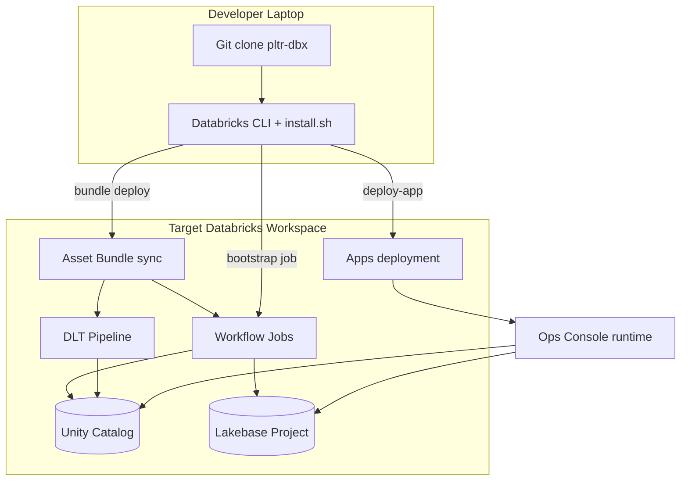

---

## 11. Non-functional characteristics

| Characteristic | Target (demo) | Notes |
|----------------|---------------|-------|
| Dispatch write latency | < 500 ms | Lakebase direct Postgres |
| Dispatch read latency | < 200 ms | Lakebase overlay read |
| Batch refresh | 3–5 min incremental | `sdp_write_refresh` |
| Full bootstrap | 8–20 min | DLT full refresh dominates |
| Availability | Best-effort | Demo workspace, no SLA |
| Concurrent users | ~10 | Flask App on Apps runtime |

---

## 12. Design decisions and trade-offs

| Decision | Rationale | Trade-off |
|----------|-----------|-----------|
| Lakebase for ops writes | Sub-second OLTP; Foundry Actions parity | Extra infra (Lakebase project setup) |
| MV + runtime overlay vs single table | Keeps batch and ops concerns separate | Two sources for effective status |
| Single schema for bronze/silver/gold | Simpler demo | Not production medallion isolation |
| DLT owns `service_incident_ops` as VIEW | Pipeline controls canonical ops shape | App writes to separate writeback table |
| Direct Postgres host (no pooler) | Apps SP OAuth compatibility | No connection pooling benefit for App |
| Human approval for agent writes | Governance / demo safety | Extra click for operators |
| Genie read-only | Prevents accidental writes from NL | Cannot action from Genie |

---

## 13. Appendix

### 13.1 Key URLs (reference deployment)

| Surface | URL |
|---------|-----|
| Ops Console | https://att-sdp-ops-ankur-1444828305810485.aws.databricksapps.com/ |
| Health check | …/health |
| Live Demo | …/live |
| GitHub repo | https://github.com/anayyar82/pltr-dbx |

### 13.2 Validation SQL

```sql
SELECT * FROM users.ankur_nayyar.metric_sdp_executive_summary;

SELECT incident_id, title, severity, incident_status, market, technician_name
FROM users.ankur_nayyar.mv_incident_dispatch_board
ORDER BY severity, opened_at;
```

### 13.3 Document history

| Version | Date | Author | Changes |
|---------|------|--------|---------|
| 1.0 | June 2026 | Platform team | Initial architecture design document |

---

*This document is maintained in the [pltr-dbx](https://github.com/anayyar82/pltr-dbx) repository. For operational procedures see [ATT_SDP_Project_Guide.md](ATT_SDP_Project_Guide.md).*
